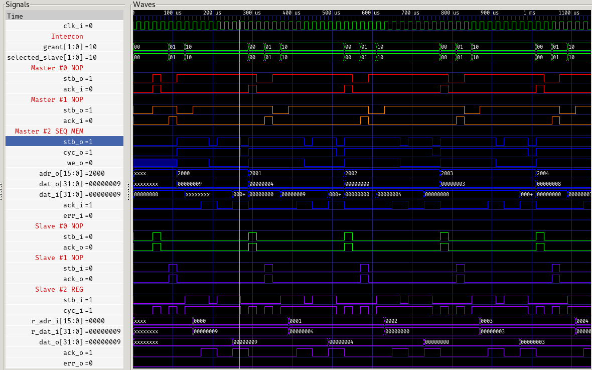

# intercon

a general Wishbone interconnect, supporting `N` masters and `M` slaves

## test scenario

in the test scenario ([testbench.sv](testbench.sv)), we have three master devices (two [wb_master_nop](wb_master_nop/) and one [wb_master_seq_mem_access](wb_master_seq_mem_access/)) and 3 slave devices (two [wb_slave_nop](wb_slave_nop/) and one [wb_slave_register](wb_slave_register/))

master device #0 (nop) always accesses address 0x0000, and master device #1 (nop) always accesses address 0x1000
master device #2 (seq_mem_access) sequentially accesses the memory range 0x2000 - 0x200f, issuing SINGLE WRITE and SINGLE READ commands

### memory map

| Adress space    | Device     |
| --------------- | ---------- |
| 0x0000 - 0x0fff | NOP0       |
| 0x1000 - 0x1fff | NOP1       |
| 0x2000 - 0x2fff | REG0       |
| 0x3000 - 0x3fff | Reserved   |
| 0x4000 - 0x4fff | Reserved   |
| 0x5000 - 0x5fff | Reserved   |
| 0x6000 - 0x6fff | Reserved   |
| 0x7000 - 0x7fff | Reserved   |
| 0x8000 - 0x8fff | Reserved   |
| 0x9000 - 0x9fff | Reserved   |
| 0xa000 - 0xafff | Reserved   |
| 0xb000 - 0xbfff | Reserved   |
| 0xc000 - 0xcfff | Reserved   |
| 0xd000 - 0xdfff | Reserved   |
| 0xe000 - 0xefff | Reserved   |
| 0xf000 - 0xffff | Reserved   |

### wave

